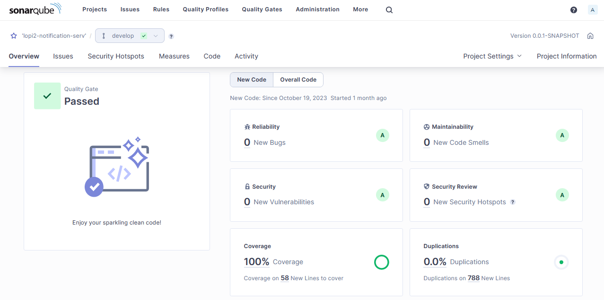

# Liftoff CMS - Notification Service

Notification Service is a Spring Boot application designed to handle various notification scenarios through email using RabbitMQ. The primary functionalities include:
- **User Activation Emails:** When a new user registers, the system sends an activation email containing a unique link to verify and activate the user account.
- **Password Reset Emails:** Users requesting a password reset receive an email with a secure link to initiate the password reset process.
- **Order Confirmation Emails:** After a successful order is placed, the system sends a detailed order summary to the user, providing information about the items, quantities, and any additional relevant details.

The application leverages the power of RabbitMQ to ensure reliable and asynchronous communication, allowing for efficient handling of notifications without impacting the main application flow. The use of Spring Boot ensures a robust and scalable solution for managing email notifications.

### Languages
This project was created with [Java](https://www.java.com) and [Spring Boot](https://spring.io/projects/spring-boot).

#### Additional Technologies and Tools
- **Code Quality:** [SonarQube](https://www.sonarsource.com/products/sonarqube/), [Qodana](https://www.jetbrains.com/qodana/)
- **Message Queue:** [RabbitMQ](https://www.rabbitmq.com/)
- **Template Engine:** [Thymeleaf](https://www.thymeleaf.org/)

